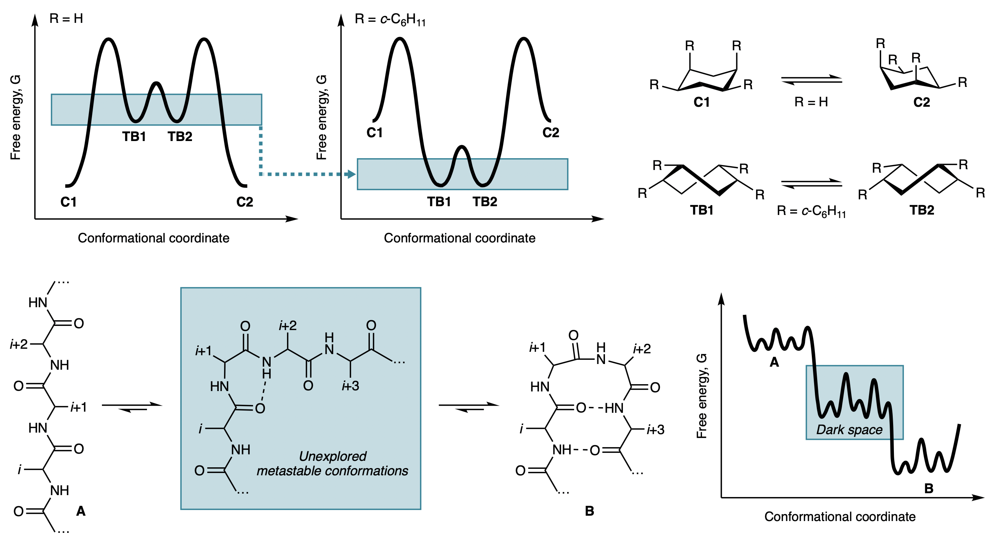

# Welcome to repository for the paper "Illuminating the dark conformational space using dominant rotors”

This is a simple repository for the geometries (xyz files) from the paper "Illuminating the dark conformational space using dominant rotors."

For more informations, please read our paper on _[Nature Chemistry](https://www.nature.com/nchem/)_: [doi: 10.TBA](TBA)

## Data
* **Geometry coordinates in .xyz format**
    * SI_data/DFT_results: coordinates of all DFT results.
* **X-Ray coordinates .cif and .xyz formats**
    * SI_data/X-ray-CIFs: .cif and .xyz coordinates for representative examples.
* **NMR of the complexes**

## Contact
Corresponding Author: Prof. Andrei Yudin andrei.yudin[at]utoronto.ca

First Author: Dr. Diego Diaz diego_diaz[at]fas.harvard.edu

Computational Chemistry Author: Dr. Gabriel dos Passos Gomes gabriel.gomes[at]utoronto.ca
